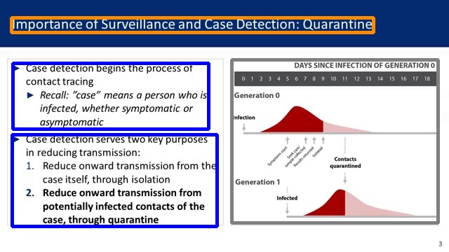

# Overview
We introduce an object detection dataset for lecture design elements. It contains a total of 51,326 bounding boxes for 12 object classes on 5,527 video frames from MOOCs. The video frames of lectures are annotated based on semantic units. For example, we grouped multi-level lists with hierarchical relationships as a single text box and complex graphics consisting of separate elements connected with arrows as a single diagram.

# Dataset Examples

<!-- <table>
  <tr>
    <td></td>
    <td></td>
    <td></td>
    <td></td>
   </tr> 
   <tr>
      <td></td>
      <td></td>
      <td></td>
      <td></td>     
  </tr>
</table> -->
<!-- 
 //
 //
 //
 //

 -->

# Image Download
[Download Link](https://drive.google.com/uc?export=download&id=1N9l5GfHLGnqrXgs7H4DbM5R1lo5zwusr)

# Licensing
* Labels are licensed under [Creative Commons Attribution 4.0 License](https://creativecommons.org/licenses/by/4.0/legalcode)
* For the images, we make no representations or warranties for the license status of each image and you should verify the license for each image yourself. "courses.txt" contains a list of courses and institutions for video lectures.

# Contact
This section will be added after the blind review process.

# Citations
This section will be added after the blind review process.
